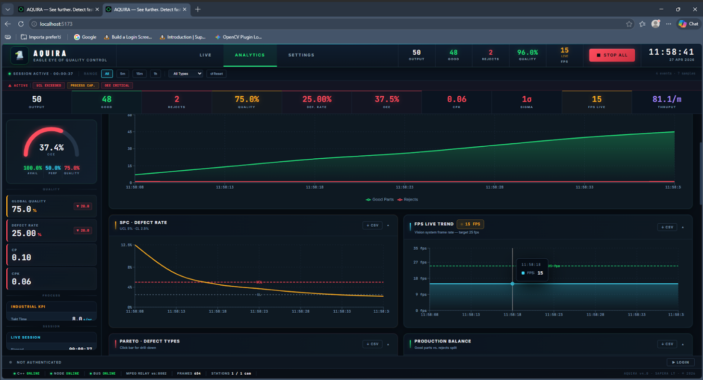

# AQUIRA — Industrial Vision System

> **Eagle Eye of Quality Control**  
> *See further. Detect faster. Deliver better.*

## Preview



Aquira è un sistema di visione industriale per il controllo qualità in produzione manifatturiera. L'architettura è ibrida: un backend nativo **C++/OpenCV** acquisisce e trasmette il video dalle telecamere industriali, un **server Node.js** fa da middleware e bus di comunicazione, e un **frontend React** espone la dashboard operativa in tempo reale.

---

## Indice

- [Architettura generale](#architettura-generale)
- [Stack tecnologico](#stack-tecnologico)
- [Struttura del progetto](#struttura-del-progetto)
- [Backend C++ — VisionSystem](#backend-c--visionsystem)
- [Server Node.js — middleware e bus](#server-nodejs--middleware-e-bus)
- [Frontend React — dashboard](#frontend-react--dashboard)
- [API REST — C++ server (porta 8080)](#api-rest--c-server-porta-8080)
- [Central Data Bus — WebSocket (porta 3000)](#central-data-bus--websocket-porta-3000)
- [Installazione e avvio](#installazione-e-avvio)
- [Build per produzione](#build-per-produzione)
- [Dipendenze C++](#dipendenze-c)
- [Credenziali demo](#credenziali-demo)

---

## Architettura generale

```
┌──────────────────────────────────────────────────────────── ─┐
│                   BROWSER / DASHBOARD                        │
│             React 19 + Vite  (porta 5173 dev)                │
│   ┌──────────┐  ┌───────────────┐  ┌─────────────────────┐   │
│   │ LIVE tab │  │ ANALYTICS tab │  │ SETTINGS tab        │   │
│   │CameraView│  │AnalyticsPanel │  │ SetupPanel          │   │
│   └──────────┘  └───────────────┘  └─────────────────────┘   │
│         │ MJPEG stream             │ WebSocket /bus          │
└─────────┼──────────────────────────┼─────────────────────────┘
          │                          │
          │ proxy /api               │
┌─────────▼──────────────────────────▼─────────────────────────┐
│                  NODE.JS SERVER  (porta 3000)                │
│   REST middleware · Central Data Bus ws · MPEG relay ws:8082 │
└─────────────────────────────┬────────────────────────────────┘
                              │ HTTP REST + MJPEG
┌─────────────────────────────▼────────────────────────────────┐
│             C++ VISION SYSTEM  (porta 8080)                  │
│   OpenCV acquisition · httplib HTTP server · broadcaster     │
│   MJPEG /api/stream/mjpeg · frame grab /api/frame            │
│               ↕ V4L2 / DirectShow / Camo / EpocCam           │
│                    TELECAMERA INDUSTRIALE                    │
│               (Genie Nano-M1920 · webcam · iPhone)           │
└──────────────────────────────────────────────────────────────┘
```

Il C++ gira come **processo separato** (eseguibile standalone, compilato con MSVC). Il Node.js fa da proxy e bus. Il frontend comunica con entrambi: per lo streaming video direttamente via MJPEG (proxiato su `/api`), per i dati operativi via WebSocket sul Central Data Bus.

---

## Stack tecnologico

| Layer | Tecnologia |
|---|---|
| Acquisizione video | C++20 · OpenCV · httplib · nlohmann/json |
| Build C++ | MSVC v143 · Visual Studio 2022 · vcpkg |
| Server middleware | Node.js (ESM) · ws · nodemailer |
| Frontend framework | React 19 · Vite 8 |
| Styling | Tailwind CSS 3 · CSS custom (glass-card system) |
| Grafici | Recharts · Chart.js + react-chartjs-2 |
| Streaming video | MJPEG nativo su `` · MPEG-TS via JSMpeg (ws:8082) |
| Font | Barlow Condensed · Rajdhani · Inter · JetBrains Mono · Orbitron |

---

## Struttura del progetto

```
aquira/
│
├── VisionSystem.cpp          # Backend C++ — acquisizione + HTTP server
├── VisionSystem.vcxproj      # Progetto Visual Studio 2022 (x64)
│
├── package.json              # Dipendenze Node + scripts npm
├── vite.config.js            # Configurazione Vite (root: src/client)
├── tailwind.config.js        # Tailwind (scansiona src/client/src/**)
├── postcss.config.js         # PostCSS (autoprefixer)
│
└── src/
    ├── server/
    │   └── server.js         # Node.js middleware + WebSocket bus
    │
    └── client/
        ├── index.html        # Entry HTML (font, favicon SVG, JSMpeg)
        └── src/
            ├── main.jsx      # Bootstrap React — monta BusProvider + App
            ├── App.jsx       # Error Boundary → AquiraMainDashboard
            ├── index.css     # Tailwind base + classi glass-card + animazioni
            │
            ├── assets/
            │   └── icons8-aquila-96.png      # Logo aquila (header)
            │
            ├── components/
            │   └── CameraVIew.jsx            # Componente stream MJPEG per camera
            │
            ├── hooks/
            │   ├── BusProvider.jsx           # Context WebSocket — connessione condivisa
            │   └── useBus.js                 # Hook React per il Central Data Bus
            │
            └── panels/
                ├── AquiraMainDashboard.jsx   # Dashboard principale
                ├── AnalyticsPanel.jsx        # Tab Analytics — grafici produzione
                └── SetupPanel.jsx            # Tab Settings — config stazioni/camera
```

---

## Backend C++ — VisionSystem

Il processo C++ è il cuore del sistema di acquisizione. Espone un **HTTP server su porta 8080** (httplib) e gestisce internamente due astrazioni principali.

### CameraStream

Ogni camera virtuale è rappresentata da un oggetto `CameraStream` che mantiene:

- l'ultimo frame JPEG in memoria (`lastJpegBuffer`), protetto da mutex
- il contatore frame (`frameCount`, atomico)
- una `condition_variable` per notificare i lettori che un nuovo frame è disponibile
- la lista di client WebSocket connessi (`wsClients`)
- il FPS misurato (`fps`, atomico) aggiornato ogni 30 frame
- il quality score del frame corrente (`qualityScore`)

I frame vengono notificati ai client HTTP long-poll via `condition_variable` e pushati ai client WebSocket in modo sincrono. I client che non rispondono vengono rimossi automaticamente dalla lista durante il push.

### Broadcaster thread

Un unico thread di acquisizione (`broadcasterThread`) legge i frame dalla webcam tramite `VisionSystem::acquire()`, li codifica in JPEG (qualità 65, OpenCV `cv::imencode`) e li distribuisce a tutte le `CameraStream` attive.

Il thread opera a circa **30 fps** (pacing via `sleep_for` di 33ms). Ogni 30 frame misura il FPS effettivo e lo logga sovrascrivendo la riga precedente in console (escape ANSI). In assenza di webcam disponibile, genera un frame di errore (sfondo scuro, testo rosso) e lo trasmette a 2 fps finché non viene trovato un dispositivo.

### Gestione alias camera

Gli ID `cam-01`, `cam-1` e `cam1` sono tutti canonicalizzati a `cam-01` dalla funzione `canonicalId()`. Questo evita la creazione di stream duplicati in caso di naming inconsistente tra i componenti.

### Thread pool e timeout HTTP

Il server usa un pool di 32 thread worker. Read timeout impostato a 5s, write timeout a 60s — necessario per tenere aperte le connessioni MJPEG a lunga durata senza timeout prematuro.

### Shutdown pulito

Il processo intercetta `CTRL+C`, `CTRL+BREAK` e `CTRL+CLOSE` via `SetConsoleCtrlHandler`. Al segnale: stoppa il broadcaster, chiude tutti gli stream attivi, termina il server HTTP in modo ordinato.

### Enumerazione dispositivi

`GET /api/cameras/enumerate` scansiona gli indici da 0 a 9 con `VisionSystem::enumerate()` e restituisce la lista di webcam trovate con risoluzione. Utile per rilevare iPhone (Camo/EpocCam) o camere virtuali oltre alla webcam di sistema.

---

## Server Node.js — middleware e bus

Il file `src/server/server.js` (ESM) serve tre funzioni principali.

**Proxy REST** — inoltra le chiamate `/api/*` dal frontend (porta 5173) verso il C++ su porta 8080, aggiungendo header `cache-control: no-cache, no-store` alle risposte.

**Central Data Bus** — WebSocket server su `/bus` (porta 3000). Gestisce la comunicazione pub/sub tra tutti i componenti del sistema: dashboard React, backend C++, eventuali agenti esterni. I messaggi di sistema (`bus.welcome`, `bus.peer_joined`, `bus.peer_left`, `bus.error`) gestiscono il ciclo di vita dei peer connessi.

**MPEG relay** — relay WebSocket su porta 8082 per lo streaming MPEG-TS tramite JSMpeg (percorso alternativo a MJPEG per contesti che richiedono decodifica hardware accelerata).

---

## Frontend React — dashboard

### `main.jsx`

Entry point dell'applicazione. Monta `<BusProvider>` come provider globale della connessione WebSocket, poi `<App>`.

### `App.jsx`

Avvolge `AquiraMainDashboard` in un `ErrorBoundary` (class component React). In caso di crash del rendering espone un pannello di errore dark-themed con il messaggio di eccezione e suggerisce di aprire la console per i dettagli.

### `BusProvider.jsx` + `useBus.js`

Unica connessione WebSocket condivisa via React Context. Caratteristiche:

- **Riconnessione automatica** con backoff esponenziale (base 1s, max 30s) e jitter ±20% per evitare thundering herd al riavvio del server
- **Handshake `join`** all'apertura — dichiara `role: 'dashboard'` e un ID univoco generato a runtime (`dash-XXXXXX`)
- **Message queue offline** — fino a 50 messaggi vengono accodati in memoria e inviati al ritorno della connessione
- **Ping client-side** ogni 20s — se il server non risponde con `pong` entro 5s, la connessione zombie viene forzatamente chiusa (`ws.close(4000)`) e riaperta
- **Subscribe topic-based** con wildcard `'*'` per ricevere tutti i messaggi
- **Cleanup automatico** — i subscriber si deregistrano al cleanup del `useEffect` chiamante

`useBus()` espone: `{ connected, reconnecting, lastError, peers, publish, subscribe }`.

### `CameraVIew.jsx`

Componente `React.memo` per la visualizzazione di un singolo stream camera. Caratteristiche:

- Streaming via **MJPEG nativo** (``) — zero latenza di decodifica, compatibile con tutti i browser moderni e embedded
- Auto-start del broadcaster C++ al mount via `POST /api/camera/start`
- **Polling FPS** da `/api/health` ogni secondo — aggiorna badge e colore (verde ≥25fps, ambra ≥15fps, rosso <15fps)
- **Auto-reload** dell'img in caso di errore stream (retry dopo 2s, nuovo `key` sull'elemento)
- **Frame grab** via `GET /api/frame?cameraId=...` — recupera il frame corrente come base64 e notifica il callback `onSnapshot`
- Modalità **fullscreen** via callback `onExpand`
- Badge qualità (`ultra`/`high`/`low`), overlay FPS con LED pulsante, badge MJPEG

### `AquiraMainDashboard.jsx`

Dashboard principale. Layout a tre tab con header fisso e status bar inferiore.

**Tab LIVE** — grid di stazioni con una o più `CameraView` per stazione. Supporta layout grid/row/vertical selezionabile. La tab LIVE rimane sempre montata anche navigando sulle altre, per mantenere attivo lo stream MJPEG senza interruzioni.

**Tab ANALYTICS** — lazy-loaded via `React.lazy`. Grafici produzione con Recharts: output nel tempo, good vs defects, FPS storico. La timeline viene campionata ogni 5s e aggiornata via `useTransition` per non bloccare la UI durante il rendering dei grafici.

**Tab SETTINGS** — lazy-loaded. Configurazione stazioni, parametri camera, impostazioni sistema.

**KPI strip in header** — aggiornata via flush ogni secondo: OUTPUT totale, GOOD, REJECTS, percentuale QUALITY, FPS live con indicatore `LIVE`.

**Bus subscriptions attive:**
- `system.health` — aggiorna stato connessioni (C++ online/offline, active streams, FPS per camera)
- `camera.fps` — aggiornamento FPS per-camera in real-time
- `production.event` — aggiorna log eventi e contatori produzione da sorgente esterna

**Simulazione produzione interna** — generatore eventi con 7% tasso difetti, accumula risultati in `useRef` e fa flush ogni 3s via `useTransition`. Tipi di difetto simulati: `GRAFFI_SUP`, `MISALIGN`, `COLORE_KO`, `BORDO_KO`, `DIMENSIONE`.

**Autenticazione demo** — pannello di login a comparsa con tre ruoli (OPERATOR, SUPERVISOR, ADMIN). Credenziali hardcoded, da sostituire con autenticazione reale in produzione.

**Status bar** — footer fisso con indicatori real-time: C++ (porta 8080), NODE (porta 3000), BUS (WebSocket), MPEG RELAY, FRAMES totali, numero STATIONS/cam.

---

## API REST — C++ server (porta 8080)

Tutti gli endpoint espongono CORS aperto (`Access-Control-Allow-Origin: *`).

| Metodo | Endpoint | Descrizione |
|---|---|---|
| `GET` | `/api/health` | Stato broadcaster: streaming, FPS, frameCount per camera |
| `GET` | `/api/cameras` | Lista camere registrate con stato streaming |
| `GET` | `/api/cameras/enumerate` | Scansiona indici 0-9, restituisce webcam trovate con risoluzione |
| `POST` | `/api/camera/start` | Avvia broadcaster + stream — body: `{ cameraId, cameraIndex }` |
| `POST` | `/api/camera/stop` | Ferma stream — body: `{ cameraId }` |
| `POST` | `/api/camera/reset` | Ferma broadcaster e tutti gli stream attivi |
| `GET` | `/api/stream/mjpeg?cameraId=X` | Stream MJPEG `multipart/x-mixed-replace` — auto-start se non attivo |
| `GET` | `/api/stream/ws?cameraId=X` | Stream raw binary: `uint32_t length` + JPEG bytes via chunked HTTP |
| `GET` | `/api/frame?cameraId=X` | Snapshot frame corrente come JSON `{ imageData: base64, score, frameCount }` |

Il flag `cameraIndex: -1` nel body di `camera/start` attiva l'auto-scan che prende il primo dispositivo disponibile.

---

## Central Data Bus — WebSocket (porta 3000)

Topic applicativi:

| Topic | Direzione | Payload |
|---|---|---|
| `system.health` | server → dashboard | `{ activeStreams, cppServer, streams: [{cameraId, fps, frameCount, running}] }` |
| `camera.fps` | server → dashboard | `{ camId, fps, frameCount }` |
| `production.event` | server → dashboard | `{ id, time, type, ok, score }` |
| `camera.command` | dashboard → cpp | `{ cmd: 'start'|'stop', camId, quality }` |
| `ping` / `pong` | bidirezionale | keepalive applicativo |

Topic di sistema (gestiti internamente dal BusProvider, non esposti ai componenti):

| Topic | Significato |
|---|---|
| `bus.welcome` | Connessione accettata — payload: lista peer correnti |
| `bus.peer_joined` | Nuovo peer connesso al bus |
| `bus.peer_left` | Peer disconnesso dal bus |
| `bus.error` | Errore segnalato dal server bus |

---

## Installazione e avvio

### Prerequisiti

- **Node.js** ≥ 18 (ESM nativo richiesto)
- **Visual Studio 2022** con workload "Desktop development with C++"
- **vcpkg** con i pacchetti: `opencv4:x64-windows`, `nlohmann-json:x64-windows`, `cpp-httplib:x64-windows`
- **Webcam** collegata (o iPhone con Camo / EpocCam installato)

### 1. Backend C++

```bash
# Aprire VisionSystem.vcxproj in Visual Studio 2022
# Selezionare configurazione: Release | x64
# Build → Build Solution  (F7)
# Output: x64/Release/VisionSystem.exe
```

Verificare che il percorso include OpenCV nel `.vcxproj` corrisponda alla propria installazione vcpkg (configurazione x64):

```
C:\dev\vcpkg\installed\x64-windows\include\opencv4
```

Le DLL OpenCV devono essere nel PATH di sistema o nella stessa cartella dell'eseguibile.

```bash
# Avviare dalla cartella del progetto
./x64/Release/VisionSystem.exe
```

### 2. Frontend + Node server

```bash
npm install
npm run dev
```

Lo script `dev` avvia in parallelo tramite `concurrently`:
- `node --watch src/server/server.js` — Node.js middleware + bus (porta 3000, con auto-restart su modifica)
- `vite` — dev server frontend con HMR (porta 5173, apre il browser automaticamente)

### Ordine di avvio consigliato

1. Avviare `VisionSystem.exe` (C++) — in ascolto su porta 8080
2. Avviare `npm run dev` — Node su 3000, Vite su 5173
3. Il browser si apre su `http://localhost:5173`
4. Premere **START ALL** nella dashboard per avviare lo streaming

---

## Build per produzione

```bash
npm run build
```

Vite compila il frontend in `dist/` con code splitting automatico:
- `vendor-react` — React + ReactDOM (chunk separato per cache browser)
- `vendor-recharts` — Recharts (chunk separato)

Per avviare il server in produzione (senza Vite dev server):

```bash
npm start
```

Il Node server serve i file statici da `dist/` e fa da proxy verso il C++ su porta 8080.

---

## Dipendenze C++

| Libreria | Utilizzo |
|---|---|
| **OpenCV 4** | Acquisizione frame webcam, encoding JPEG (`cv::imencode`), generazione frame di errore |
| **cpp-httplib** | HTTP server single-header — REST endpoint + chunked streaming MJPEG |
| **nlohmann/json** | Serializzazione/deserializzazione JSON per tutte le API |
| **WinSock2 / iphlpapi** | Enumerazione indirizzi IP locali per stampare gli URL di rete all'avvio |

Standard C++: **C++20** (vcxproj: `<LanguageStandard>stdcpp20</LanguageStandard>`).

---

## Dipendenze Node/frontend principali

| Pacchetto | Utilizzo |
|---|---|
| `react` / `react-dom` 19 | Framework UI con Concurrent Features (useTransition) |
| `recharts` 3 | Grafici analytics — LineChart, AreaChart, composable |
| `chart.js` + `react-chartjs-2` | Grafici alternativi |
| `lucide-react` | Icone SVG inline |
| `react-rnd` | Pannelli ridimensionabili e draggabili |
| `jsmpeg-player` | Decodifica MPEG-TS via WebSocket (relay porta 8082) |
| `ws` | WebSocket server Node.js — Central Data Bus |
| `nodemailer` | Notifiche email per alert qualità |
| `concurrently` | Avvio parallelo Node + Vite in development |

---

## Credenziali demo

La dashboard include un sistema di autenticazione demo (hardcoded, solo per sviluppo):

| Username | Password | Ruolo |
|---|---|---|
| `operator` | `1234` | OPERATOR |
| `supervisor` | `1234` | SUPERVISOR |
| `admin` | `1234` | ADMIN |

---

## Note tecniche

**Perché MJPEG e non WebRTC o HLS?** In ambiente industriale locale, MJPEG via `` offre latenza minima (<100ms), nessuna dipendenza da browser API complesse, e funziona su qualsiasi client inclusi dispositivi embedded. Il C++ usa `multipart/x-mixed-replace` con chunked transfer encoding — ogni frame è un boundary JPEG autonomo e autoconsistente.

**Perché un singolo broadcaster thread?** L'hardware attuale prevede una singola telecamera fisica (Genie Nano-M1920) multiplexata a tutte le camere virtuali registrate. L'architettura è pronta per aggiungere broadcaster thread separati per ogni camera fisica aggiuntiva.

**Gestione re-render nel frontend.** Le metriche real-time (FPS, frame count) vengono accumulate in `useRef` e flushate via `setState` a frequenza limitata: 1Hz per i KPI header, ogni 3s per il log eventi, ogni 5s per la timeline analytics. `useTransition` garantisce che gli aggiornamenti dei grafici non blocchino l'interattività della UI durante lo streaming ad alto FPS.

**Formato stream raw (`/api/stream/ws`).** Ogni frame nel canale binary è preceduto da un `uint32_t` little-endian che indica la lunghezza in byte del JPEG seguente. Questo permette al client di framing corretto senza dipendere dai boundary MIME di MJPEG.
